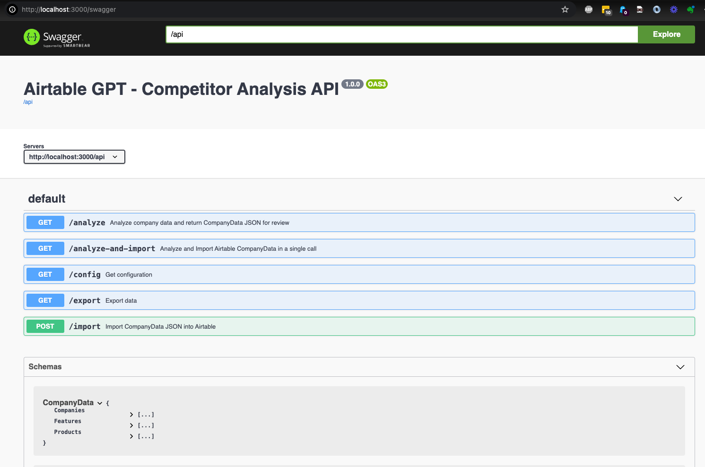

# Airtable GPT - Competitor Analysis

## Overview

Airtable GPT - Competitor Analysis API and CLI tools

Performs automated competitor analysis given a company's website URL using OpenAI's GPT-4o (Omni). Airtable GPT provides a simple webappp (React), and CLI tools to analyze and import data, along with a set of APIs (Swagger) to extract key Company, Product, and Features information and automatically import into your copy of the competitor tracking Airtable base.

(Based on Airtable GPT - Competitor Tracking - [Template base](https://www.airtable.com/templates/competitor-tracking/expQhQ5bgx8xspSEi))

Template base URL: [Airtable GPT - Competitor Tracking](https://airtable.com/appjkwEzr4ZzueYLq/shr6AIp2qwBlZfKki)

## Motivation

Why build this?  Shortly after GPT 4o came out I was doing some competitor analysis for some new projects, and went to ChatGPT to see if it could help extract info from company websites.  After 20 mins of creative prompting, and initial code generation I found that data could be reliabily extracted and imported automatically info Airtable.  In typical develper fashion, wanting to avoid manually creating Company, Product and Feature entries for 50+ products this app was created!

## Features

- **Automated Analysis**: Extracts competitor information from website URLs.
- **API Integration**: RESTful APIs to fetch data for integration with other tools.
- **CLI Tools**: Command-line interface for quick analysis, Airtable data import and export.
- **Airtable Integration**: Seamlessly import competitor data into Airtable.

## Tech

- **Perl / Mojolicious**
- **React**
- **OpenAI GPT-4o**
- **Swagger for API documentation**


## Installation

Clone the repository:

```sh
git clone https://github.com/ericblue/airtable-gpt-competitor-analysis.git
cd airtable-gpt-competitor-analysis
```

Install dependencies (installs from cpanfile):

```sh
make install
```

## Setup

- Make a copy of the Airtable template at [Airtable GPT - Competitor Tracking](https://airtable.com/appjkwEzr4ZzueYLq/shr6AIp2qwBlZfKki)
- Get your Airtable API key/Perrsonal access token - See: https://support.airtable.com/docs/creating-personal-access-tokens
- Take note of your Airtable Base ID (simple method is to note the portion of the URL starting with *app*)
- OpenAI GPT-4o model acess is required and keys can be obtained at [OpenAI Account Keys](https://platform.openai.com/account/api-keys)  

## Airtable Configuration

Note: The screenshot below is a snapshot of the original Airtable Competitor Tracking base.  The modified template being used for this project adds a few additional fields:

* VC Funding?
* Funding Amount
* Investors
* Press Link


Note on Features

Both the CLI Analyzer script and API endpoint will take a boolean (leverage_existing_features).  If you already have a number of Features for a given Product defined, setting this value to true will inform ChatGPT to try to fit a company's product features into the existing categories.  Otherwise, it will new ones automatically.  Sometimes it is helpful to set this boolean to false to see if there any product features that you handn't previously considered, and add those into your base.

## Development Environment

### Environment Variables

This app supports configuration via environment variables and loading via a .env file. Any environment variables present on startup, or contained in the .env file in the current working directory will be loaded at runtime.

Example .env file:

```
# Your OpenAI API Key
OPENAI_API_KEY=sk-G.....O83

# Your Airtable API key/personal access token
AIRTABLE_API_KEY=pat.....330

# Your Airtable base ID
AIRTABLE_BASE_ID=app6..88

# Host the server will listen on - default = localhost
# Note: To run with Docker or on Heroku, this value will need to 
# be set to 0.0.0.0  You can comment these out for local dev, but may want
# to override for Docker.
HOST=localhost

# Port the server will listen on - default = 3000
PORT=3000
```


### Running the CLI Tool

Analyze a competitor's website:

```sh
perl cli/analyze_company.pl https://competitor.com

2024/05/18 14:52:13 INFO Leveraging existing features
2024/05/18 14:52:13 INFO Analyzing company https://competitor.com...
2024/05/18 14:52:21 INFO Writing JSON files to ./json
2024/05/18 14:52:21 INFO JSON files created at ./json
```
This saves the competitor data to a JSONs files in the json directory under company, features and product subdirectories.  While the results generated from ChatGPT are generally very good, you may want to review the data before you run the import.  Note: there are sometimes random hallucinations on press release links and VC funding amounts.

Sample JSON data (json/company.json):

```
{
   "fields" : {
      "Approx. Number of Employees" : 250,
      "Founded" : 2016,
      "VC Funding" : true,
      "Company URL" : "https://notion.so",
			...
      "Name" : "Notion Labs Inc.",
      "Investors" : "Index Ventures, Coatue Management, Sequoia Capital"
   }
}
```

Import the competitor data into Airtable:

```sh
perl cli/import_airtable.pl
```


### Running the API

Start the API server (using Mojolicous):

```sh
make runWeb
perl app.pl daemon
2024/05/18 14:56:59 INFO Log level set to DEBUG
[2024-05-18 14:56:59.19408] [93155] [info] Listening at "http://localhost:3000"
Web application available at http://localhost:3000
```

### Swagger Endpoints




### Accessing the Web App

After running the local web and API server, browse to http://localhost:3000

Starter Page

The starter page gives quick links to the Github repo, Swagger endpoints, and React App


React App

The simple UI under the /app endpoint will allow you to:
- Analyze a company URL and import the data
- Perform bulk imports on a given list of URLs.  Dryruns are enabled by default to review the data before importing.
- Export all Airtable data in JSON format.


### Modifying and Building the React App

The React app has already been built and accessible under the http://localhost:3000/app endpoint and compiled to the resources/public/static and resources/public/app directories.

If you wish to make modification you can run the following commands:

```sh
# Removes current react app from the resources/public dir served by Mojolicous
make cleanReactApp
# Clean/Wipe removes node_modules, build dirs and package-json.lock files
make cleanReactBuild
# Does a fresh npm install and build; and copies build artifacts back to resources/public
make buildReactApp
# Runs react in dev mode (e.g. port 3001) so files under react-app can be built and tested
# Note: a proxy is set to automatically forward to http://localhost:3000
make runReactDev

```


## Docker

Build and run the Docker image:

```sh
make buildDocker
make runDocker
```

The image can also be pulled and run from https://hub.docker.com/repository/docker/ericblue/airtable-gpt-competitor-analysis/

## Version History

- **0.2** - 5/19/2024 -  Added bulk analyze & import features
- **0.1** - 5/18/2024 -  Initial release

## License

This project is licensed under the MIT License - see the [LICENSE](LICENSE) file for details.

## Author

Created by Eric Blue ([https://eric-blue.com](https://eric-blue.com/))